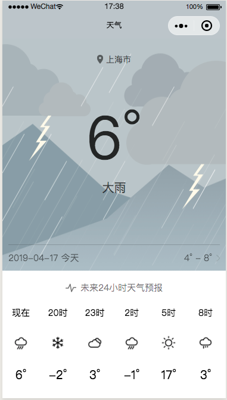

# 天气

本项目主要实现了获取当前位置，从服务器请求天气数据展示在页面上，适合小程序初学者（ps：天气数据为虚拟数据）

## 页面展示

 |  |  |
| :--: | :--: | :--: |
| 1 | 2 | 3 |

## 运行项目

1. 安装[微信开发者工具](https://developers.weixin.qq.com/miniprogram/dev/devtools/download.html)

2. 下载源码，打开微信开发者，选择小程序导入源码，**AppID改为自己申请的**，或者手动在**project.config.json**文件中修改**appid**的值

3. 项目中使用到腾讯位置服务获取城市名，相关知识可以[参考](https://lbs.qq.com/qqmap_wx_jssdk/method-reverseGeocoder.html)这篇文章

## 进阶学习项目

* [闲读 ∙ 资讯(新闻类 项目实战)](https://github.com/fujianlian/leisure-news)

* [Mall(商城类 项目实战)](https://github.com/fujianlian/mall)

* [侃影评(影评类 项目实战)](https://github.com/fujianlian/movie)

## 后记

如果你觉得对你有帮助的话，顺手 **点个Star**，笔者需要您的支持